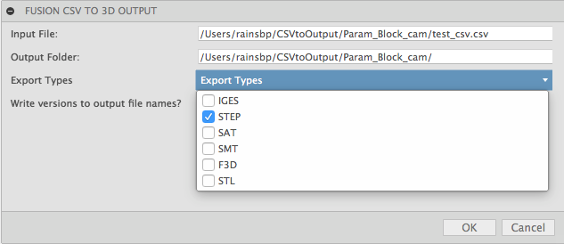
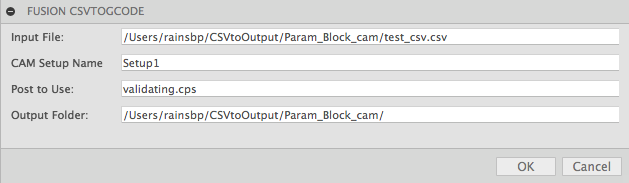
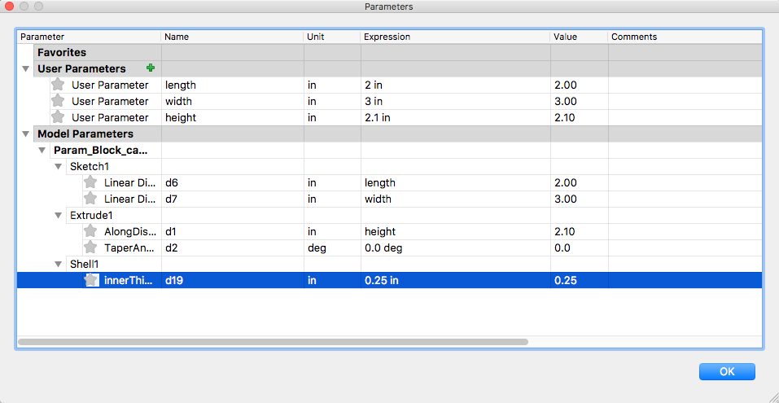
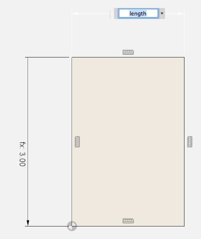
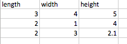

# Fusion360 CSV to Output
Use a csv file to update model parameters.

Output either:
* 3D geometry as neutral or f3d format
* G-Code if your model has a valid CAM setup in it

# Installation
[Click here to download the Add-in](https://github.com/tapnair/FusionCSVtoOutput/archive/master.zip)

After downloading the zip file follow the [installation instructions here](https://tapnair.github.io/installation.html) for your particular OS version of Fusion 360

# Usage
Documentation to come later. For now:
 - Create a Fusion 360 model
 - Use "User Defined" parameters to build your model
 - Create a csv file with the first line containing the names of your parameters
 - Subsequent lines should have the values for the corresponding variable
 - Run FusionCSVto3DOutput to generate 3D models for every configuration in the csv file
 - Run FusionCSVtoGCode to generate g-code for each configuration based on a given setup name and post name

### Outputing G-Code
 - The setup name needs to match a setup in your CAM environment
 - The post should be a post in your default directory.
 - _Some modifications would need to be made to use a post from a different location_

### Fusion model Parameters
 - Create "User Parameters" in Modify/Change Parameters
 - In your sketch dimensions and features reference these names
 - These parameter names must match the names in the csv file header row

## License
Samples are licensed under the terms of the [MIT License](http://opensource.org/licenses/MIT). Please see the [LICENSE](LICENSE) file for full details.

## Written by

Written by [Patrick Rainsberry](https://twitter.com/prrainsberry)   (Autodesk Fusion 360 Business Development)

See more useful add-ins [Fusion 360 Utilities](https://tapnair.github.io/index.html)

